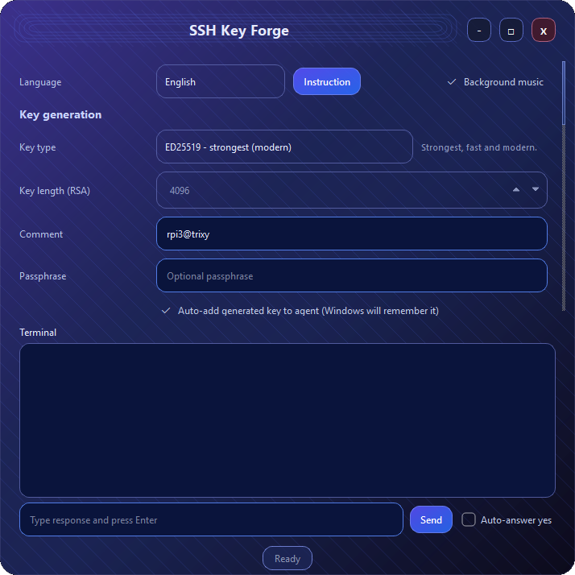
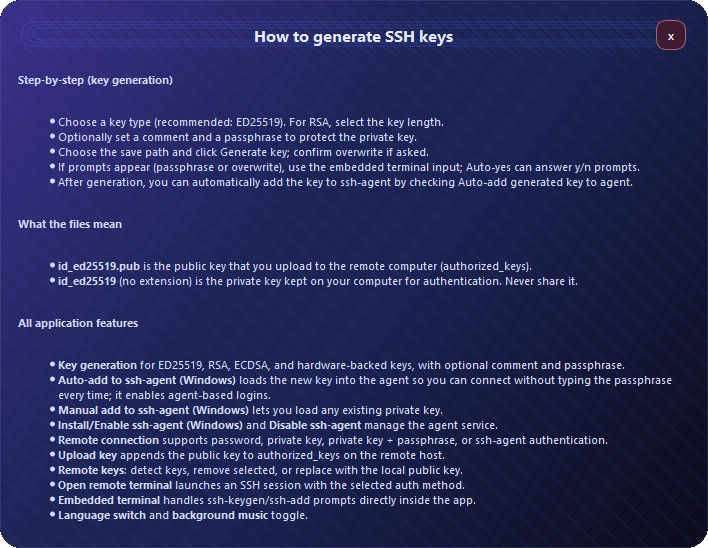
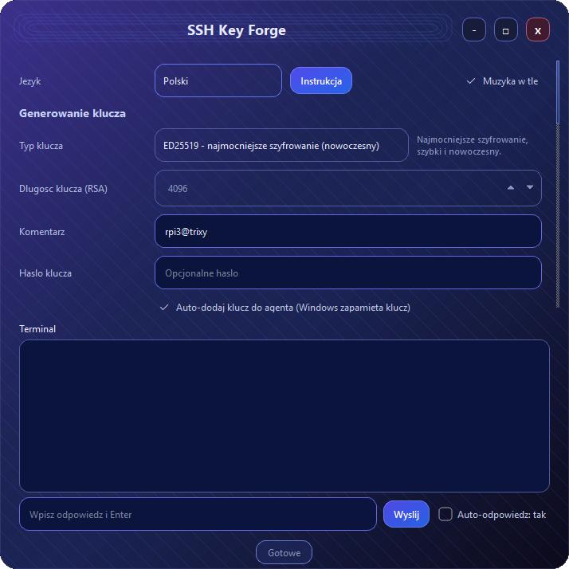
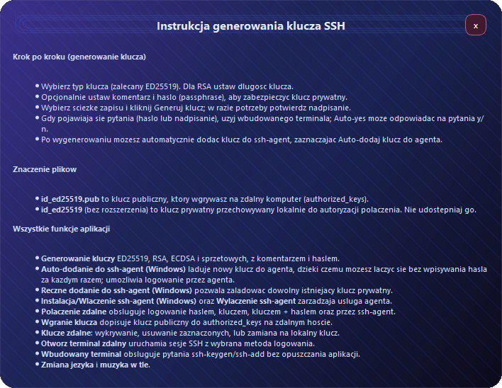

# SSH Key Forge

[Polski](#polski)

**SSH Key Forge** is a sleek PyQt6 desktop app for generating SSH keys, adding them to the Windows ssh-agent, and managing remote authorized keys — all with an embedded terminal for prompts and confirmations.

## :key: Features
- :zap: Generate SSH keys (ED25519, RSA, ECDSA, hardware-backed) with comment and passphrase
- :computer: Embedded terminal for `ssh-keygen` / `ssh-add` prompts and y/n confirmations
- :shield: Auto-add generated keys to Windows ssh-agent
- :wrench: Manual add of any private key to Windows ssh-agent
- :lock: Manage remote `authorized_keys` (detect, remove, replace)
- :satellite: Multiple auth methods for remote connections (password / key / agent)
- :globe_with_meridians: English + Polish UI
- :notes: Background music toggle

## :camera: Screenshots




## :rocket: Quick Start (Windows)
1. Install OpenSSH Client (Windows optional feature).
2. Run the app.
3. Generate a key and respond to prompts directly in the embedded terminal.
4. Optionally enable **Auto-add to ssh-agent** for passwordless logins.

## :package: Build EXE (Windows)
From the project root:

```
py -m venv .venv
.\.venv\Scripts\python -m pip install --upgrade pip
.\.venv\Scripts\python -m pip install PyQt6 paramiko pyinstaller
.\.venv\Scripts\python -m PyInstaller --noconfirm --clean --onefile --windowed --name SSHKeyForge --icon icon.ico --add-data "bg.mp3;." ssh_key_forge.py
```

The EXE will appear in `dist/SSHKeyForge.exe`.

## :information_source: Notes
- The embedded terminal is required for passphrase and overwrite prompts, so the app works cleanly in EXE form.
- `id_ed25519.pub` is the **public** key to upload to the remote host; `id_ed25519` (no extension) is your **private** key and must stay local.

---

# Polski

**SSH Key Forge** to nowoczesna aplikacja desktopowa (PyQt6) do generowania kluczy SSH, dodawania ich do Windows ssh-agent oraz zarządzania `authorized_keys` na zdalnym hoście — wszystko z wbudowanym terminalem do interakcji.

## :key: Funkcje
- :zap: Generowanie kluczy SSH (ED25519, RSA, ECDSA, sprzętowe) z komentarzem i hasłem
- :computer: Wbudowany terminal do pytań `ssh-keygen` / `ssh-add` i potwierdzeń y/n
- :shield: Auto-dodanie wygenerowanego klucza do Windows ssh-agent
- :wrench: Ręczne dodanie dowolnego klucza prywatnego do agenta
- :lock: Zarządzanie `authorized_keys` na zdalnym hoście (wykrywanie, usuwanie, zamiana)
- :satellite: Różne metody logowania (hasło / klucz / agent)
- :globe_with_meridians: Język polski i angielski
- :notes: Muzyka w tle

## :camera: Zrzuty ekranu




## :rocket: Szybki start (Windows)
1. Zainstaluj OpenSSH Client (opcjonalna funkcja Windows).
2. Uruchom aplikację.
3. Wygeneruj klucz i odpowiadaj na pytania w terminalu aplikacji.
4. Opcjonalnie włącz **Auto-dodaj do agenta**, aby logować się bez hasła.

## :package: Budowa EXE (Windows)
W katalogu projektu:

```
py -m venv .venv
.\.venv\Scripts\python -m pip install --upgrade pip
.\.venv\Scripts\python -m pip install PyQt6 paramiko pyinstaller
.\.venv\Scripts\python -m PyInstaller --noconfirm --clean --onefile --windowed --name SSHKeyForge --icon icon.ico --add-data "bg.mp3;." ssh_key_forge.py
```

Plik EXE pojawi się w `dist/SSHKeyForge.exe`.

## :information_source: Ważne informacje
- Wbudowany terminal obsługuje pytania o hasło i nadpisanie pliku, dlatego aplikacja działa poprawnie jako EXE.
- `id_ed25519.pub` to klucz **publiczny** do wgrania na zdalny host; `id_ed25519` (bez rozszerzenia) to klucz **prywatny** i musi pozostać lokalnie.

